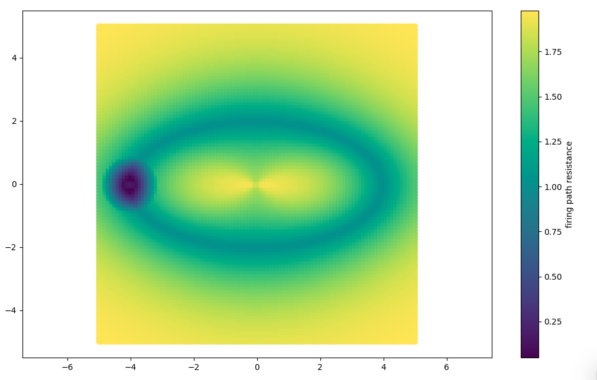
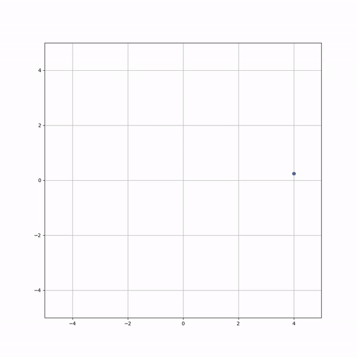

# Neural Statespace Modeling

This is a library of neural statespace models. It's currently only a small set of experiments, some more successful than others.

It's inspired by conversations with [@drsiyarb](https://github.com/drsiyarb), [his ideas](https://github.com/drsiyarb/NDCA), and my [own writing](https://bartholomy.substack.com/).

## Visualizations

This is the firing path:

This is a single neural state traversing that field:

